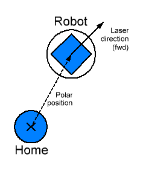
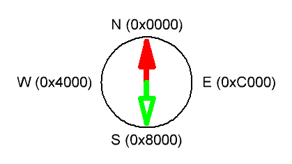
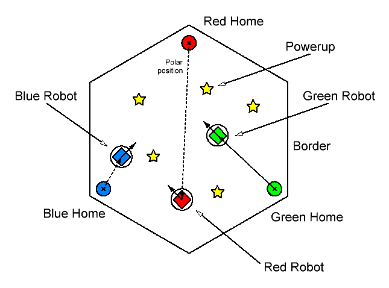

# Coordinates
The coordinate system is polar and relative to each robot's home and the Earth's magnetic north.

Directions are unsigned 16-bit full scale values that go counter-clockwise starting at north.

## Venue

## Calibration
- Robots are told a direction to travel that matches for all three robots
- They should then bounce into the border and follow it until they find find their home twice (measure distances between homes)
- Once all homes are found and distances measured, they are safely moved to their individual homes without collision and rotated towards the center
- Common power-ups could be used to re-calibrate later (or periodically go home)
- Earth's magnetic field is used as an absolute direction indicator
- Accelerometer is used to increase the driving accuracy
